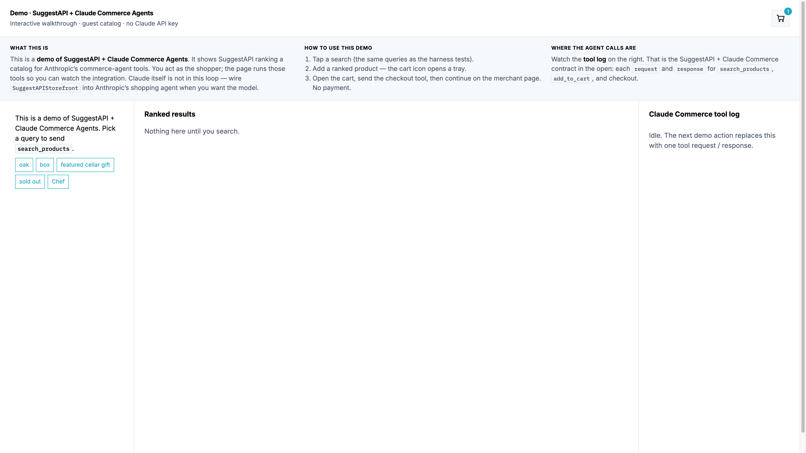

# SuggestAPI + Claude Commerce Agents

A starter [`StorefrontBackend`](https://github.com/anthropics/commerce-agents/blob/main/shopping-agent/core/shopping_agent/backend.py) that points [Anthropic's commerce agents](https://github.com/anthropics/commerce-agents) at SuggestAPI for product discovery.

Claude Commerce already calls `search_products` and `get_product_details`. This adapter implements those methods: SuggestAPI returns ranked catalog results, and Claude compares, presents, and fills the cart.

Checkout stays on the merchant storefront. SuggestAPI does not take payment.

**Live demo:** https://suggestapi-claude-commerce-agents.onrender.com/



## Run the shopper

Python 3.11+. No extra packages, no API keys.

```bash
python3 tests/test_harness.py
```

The test run prints each Claude Commerce tool (`search_products`, `add_to_cart`, `checkout_handoff`) and the ranked products, so you can see the loop before opening a browser.

```bash
python3 demo/server.py
```

Open http://127.0.0.1:8765 (uses 8766+ if that port is taken)

1. Tap a chat example (`oak`, `box`, `featured cellar gift`, `sold out`, `Chef`) — same queries as `tests/test_harness.py`
2. **Add to cart** on a result
3. **Checkout on merchant storefront** — the tool log on the right shows `request` / `response`, then open the merchant handoff (no payment)

This page is a **demo of SuggestAPI + Claude Commerce Agents**. You shop; SuggestAPI ranks; the on-page tool log is the same `search_products` → `add_to_cart` → checkout contract Anthropic’s shopping agent uses. Claude is not called here — point that agent at `SuggestAPIStorefront` when you want the model in the loop.

Guest mode reads `tests/fixtures.json`. Live catalog:

```bash
SUGGESTAPI_LIVE=1 SUGGESTAPI_TENANT=your-store.example.com python3 demo/server.py
```

Public demo on Render (guest catalog, no API keys). Push this repo, then in the dashboard: **New → Web Service**, connect the GitHub repo, language **Docker**, instance **Free**. Or apply the Blueprint from `render.yaml`.

The service listens on Render’s `PORT`. The first request after idle can take about a minute while the free instance wakes up.

## Wire into Anthropic's retail demo

```bash
git clone https://github.com/anthropics/commerce-agents.git
cd commerce-agents
python3 -m venv .venv && source .venv/bin/activate
pip install -r requirements.txt
```

Put this repo on `PYTHONPATH`, or copy `map_product.py` and `suggestapi_backend.py` next to the retail API. Replace `MockRetail` with:

```python
from suggestapi_backend import SuggestAPIStorefront

backend = SuggestAPIStorefront(tenant="your-store.example.com")
```

| Variable | Purpose |
|---|---|
| `SUGGESTAPI_TENANT` | Merchant domain whose catalog SuggestAPI should search |
| `SUGGESTAPI_BASE_URL` | SuggestAPI agent API (default `https://agent.suggestapi.com`) |
| `SUGGESTAPI_API_KEY` | Optional `x-api-key` if your SuggestAPI project requires it |
| `ANTHROPIC_API_KEY` | Required by Anthropic's demo host, not by this starter |
| `SUGGESTAPI_LIVE` | Set to `1` to skip fixtures in `demo/server.py` |

## Docs

- [Anatomy of effective commerce agents](https://claude.com/blog/the-anatomy-of-effective-commerce-agents)
- [Commerce agents use-case guide](https://platform.claude.com/docs/en/about-claude/use-case-guides/commerce-agents)
- [SuggestAPI](https://suggestapi.com)
